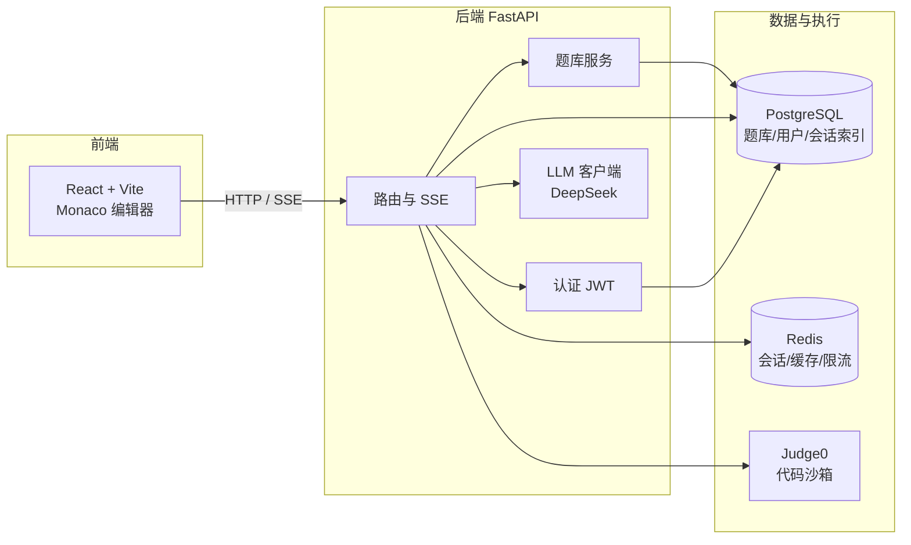

# AI 面试模拟器（Interview AI）

一个基于大模型的 AI 面试训练平台：AI 面试官出题，候选人在线写代码、运行判题、获取点评，最后得到多维度评分。项目涵盖 **LLM 成本工程**、**题库知识库**、**用户认证**三大技术板块。

## ✨ 功能

- **AI 面试流程**：按方向/难度/语言出题 → Monaco 编辑器写代码 → 运行/判题 → 流式 AI 点评 → 追问 → 加权评分（5 维度 × 10 分制）
- **题库知识库**：题目按方向/难度/语言入库，三层质检（规则校验 + Judge0 实跑参考解法 + LLM 审题），状态机流转（draft → new → published/rejected）
- **检索式出题**：题库优先（零 LLM 成本），未命中降级为 LLM 生成
- **自动判题**：用题库隐藏用例运行用户代码，返回通过率，判题结果注入 AI 点评
- **题目质量闭环**：用户赞踩 + 冷启动 10 条评价自动裁决转正/踢出；面试评分回写题目均分驱动难度校准
- **用户系统**：注册/登录（JWT + bcrypt）、先玩后登录（匿名历史自动合并）、会话历史跨设备、个人中心（统计、薄弱方向分析、改密）
- **LLM 成本优化**：会话摘要、上下文裁剪、执行结果摘要、重复反馈缓存、token 预算与降级兜底

## 🏗 架构



**数据分层**：PostgreSQL 存真相数据（题库、评价、评分标准、用户、会话索引），Redis 存热数据与状态（会话消息、已用题、登录限流、token 黑名单）。

## 🚀 快速开始（Docker 一键启动）

```bash
# 1. 准备密钥
cp .env.example .env
# 编辑 .env，填入 DEEPSEEK_API_KEY（必填）和 JWT_SECRET

# 2. 启动全部服务（Judge0 + PostgreSQL + Redis + 后端 + 前端）
docker compose up -d --build

# 3. 初始化知识库表结构（首次）
docker compose exec backend python -c "import asyncio; from database import init_db; asyncio.run(init_db())"

# 4. 导入种子数据（手工黄金题 + 评分标准）
docker compose exec backend python seed_data.py
```

访问：前端 http://localhost:5173 ，后端 API 文档 http://localhost:8000/docs

## 💻 本地开发

**依赖**：Python 3.12、Node.js 22、Docker Desktop（Judge0 全家桶 + PostgreSQL + Redis）

```bash
# 1. 启动基础设施（Judge0 含 PostgreSQL 与 Redis）
cd judge0 && docker compose up -d

# 2. 后端
cd backend
python -m venv .venv && .venv\Scripts\activate  # Windows
pip install -r requirements.txt
cp .env.example .env   # 填 DEEPSEEK_API_KEY
python -c "import asyncio; from database import init_db; asyncio.run(init_db())"
python seed_data.py
uvicorn main:app --reload --port 8000

# 3. 前端
cd frontend
npm install
npm run dev
```

## ⚙ 环境变量

| 变量 | 必填 | 说明 | 默认 |
| --- | --- | --- | --- |
| `DEEPSEEK_API_KEY` | ✅ | DeepSeek API 密钥 | — |
| `DEEPSEEK_BASE_URL` | | API 地址 | `https://api.deepseek.com/v1` |
| `DATABASE_URL` | | PostgreSQL 连接串（asyncpg） | 本地 kb-db |
| `REDIS_URL` | | Redis 连接串 | `redis://localhost:6379/0` |
| `JUDGE0_URL` | | Judge0 地址 | `http://localhost:2358` |
| `JWT_SECRET` | ✅ | JWT 签名密钥（生产必须替换） | 开发默认值 |
| `JWT_EXPIRE_DAYS` | | Token 有效期（天） | `7` |
| `CORS_ORIGINS` | | 允许的前端源（JSON 数组） | `["http://localhost:5173"]` |

## 🧪 测试

```bash
cd backend
pytest -q          # 后端 107 项：认证/题库/质检/会话/端点（SSE）/限流
cd ../frontend
npm run lint && npm run build
```

CI：push 到 `main` 自动运行后端测试与前端构建（GitHub Actions）。

## 🗄 数据库迁移（Alembic）

```bash
cd backend
alembic upgrade head                        # 应用迁移
alembic revision --autogenerate -m "描述"    # 模型变更后生成新迁移
```

## 📁 项目结构

```
backend/            FastAPI 后端（路由、认证、题库、AI 客户端、迁移）
frontend/           React + Vite 前端（面试界面、题库管理、登录/个人中心）
judge0/             Judge0 代码沙箱编排与配置
docker-compose.yml  全栈一键编排（include judge0）
```

## 📜 更新日志

见 [CHANGELOG.md](CHANGELOG.md)。
